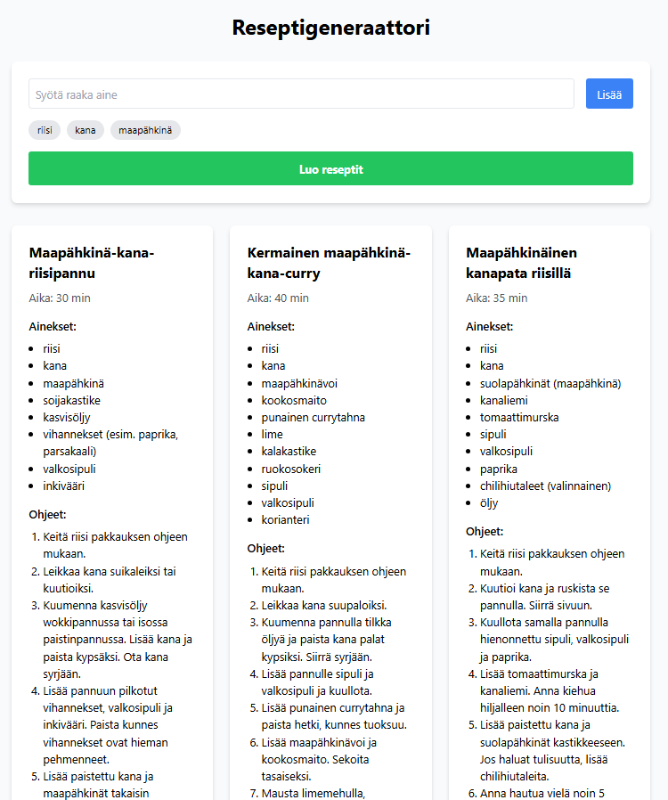

Recipe Generator
================

An AI powered web application for generating recipes. The application creates three distinct recipes from your inputted ingredients.

Screenshot
==========

Technologies
============

1. Frontend: React, TypeScript, Vite, Tailwind CSS
2. Backend: Python, FastAPI
3. AI: Google Gemini API

Installation
============

Backend setup
=============

1. Open a terminal in the project root directory.
2. Create a virtual environment with the command python -m venv venv
3. Activate the virtual environment.
4. Install dependencies with the command pip install fastapi uvicorn pydantic google-generativeai python-dotenv
5. Create a .env file. Add your API key to the file using the format GEMINI_API_KEY=your_api_key_here
6. Start the server with the command uvicorn main:app --reload

Frontend setup
==============

1. Open a new terminal inside the frontend directory.
2. Install dependencies with the command npm install
3. Start the application with the command npm run dev